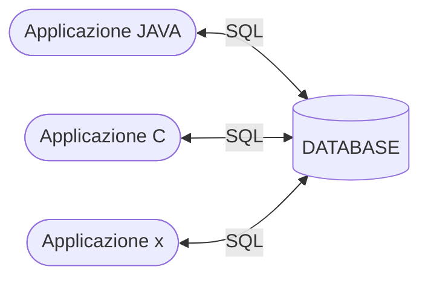
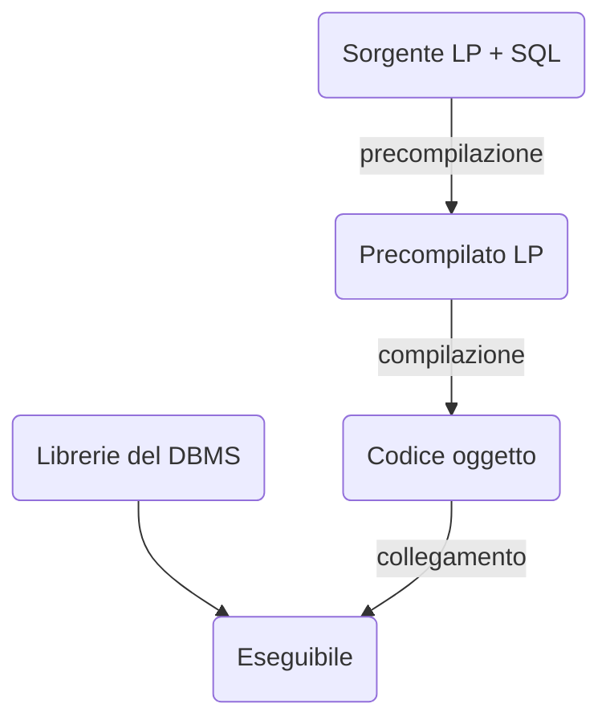
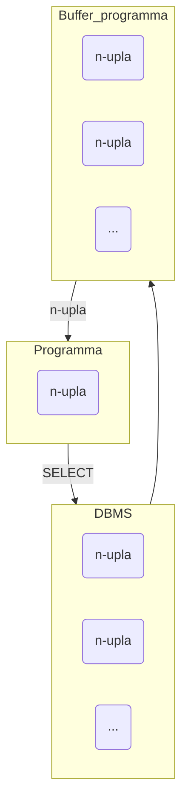

#sql #sql-embedded #prodedura
<center> Table of contents </center>

- [[#Procedura]]
- [[#Linguaggi SQL]]
	- [[#Linguaggio immerso]]
	- [[#SQL dinamico]]
 - [[#Call Level Interface]]

# Introduzione
SQL non basta solo così com'è: servono dei modi per aggiungere funzionalità necessarie:
- input, scelta utente e parametri;
- output, dati non relazionali o presentazioni complesse;
- gestione di controllo

## Procedura
Una <u>procedura</u> è una sequenza d'istruzioni SQL con parametri; ci è permesso in `psql` d'immagazzinare all'interno del nostro DB diverse procedure. Usiamo le procedure mettendo nelle stesse dei *parametri* che andranno sostituiti con i dati da inserirsi.

```sql
-- per creare una procedura
PROCEDURE AssegnaCitta(:Dip VARCHAR(20), :Citta VARCHAR(20));
```

Per essere usate, le procedure vengono invocate:
- internamente
  ```sql
  EXECUTE PROCEDURE
  AssegnaCitta('Produzione','Milano');
  ```
- esternamente
  ```bash
  $ AssegnaCitta(:NomeDip,:NomeCitta);
  ```

## Linguaggi SQL
Ogni sistema adotta di per se una propria estensione di SQL, i linguaggi finiscono col diventare dei veri e propri linguaggi ad hoc nle momento in cui il linguaggio che si approccia al DB diventa unico di per se.


Per poter prendere un linguaggio e poterlo adattare/integrare ad SQL, dobbiamo superare un importante blocco che prende nome di *conflitto d'indipendeza*: per come e' fatto, SQL svolge operazioni su relazioni (insiemi di $n$-uple), mentre i linguaggu operano su singole variabili od oggetti.

### Linguaggio immerso
Le istruzioni SQL sono "immerse" nel programma redatto nel linguaggio ospite, nel senso che un *precompilatore* prende in carico le istruzioni e le traduce direttamente nel linguaggio ospite grazie a chiamate a funzioni API del DBMS.

```c
#include <stdlib.h>

main() {
	// per specificare al precompilatore la definizione dei dati
	exec sql begin declare section;
		// SQL
	exec sql end declare section;

	exec sql connect to utente@librobd;
	
	exec sql insert into tabella
		// SQL
	exec sql disconnect all;
}
```



Per risolvere il conflitto d'indipendenza del linguaggio immerso utilizziamo il concetto di **cursore**: le $n$-uple vengono trasmesse una alla volta, gradualmente, al nostro programma.



Il nostro cursore prende in carico tutte le $n$-uple che vengono generate dall'interrogazione e in modo globale le accumula (con il DMBS che sceglie la strategia migliore), fornendole poi una alla volta, al programma.

### SQL dinamico
Al giorno d'oggi, quasi tutti i sistemi l'adottano: la struttura dell'interrogazione non è nota a compilazione del programma. Ci permette di eseguire istruzioni SQL costruite dal programma.
```sql
-- eseguire immediatamente
execute immediate SQLstatement
```

```sql
-- prima prepariamo
prepare CommandName from SQLstatement
```

```sql
-- e poi eseguire
execute commandName [into targetList]
					[using parameterList]
```

*DynamicSQL* è anche un problema riguardo la sicurezza del DBMS.
Semplici sono gli attacchi d'iniezione di query maliziose (*query injection*), che possiamo evitare applicando *barriere di sicurezza*, come quella del *privilegio minimo* per l'utente che si connette al DB.

## Call Level Interface
