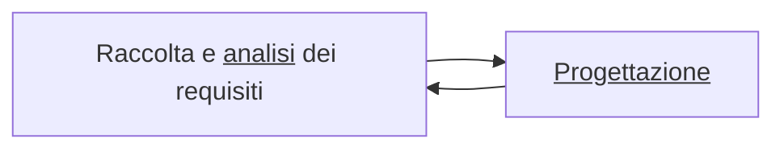
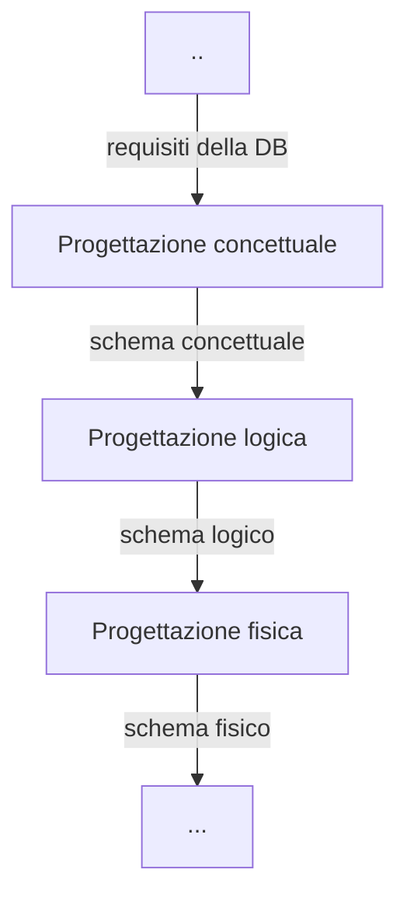

```toc
```
# Preoccuparci della modellazione
L'idea è che in una fase iniziale di progetto, lo schema logico dei dati sia troppo dettagliato: è quello che diamo in mani a chi deve implementare il DB quando noi stiamo ancora decidendo se costruire o meno la casa. Serve del tempo prima che la bozza si avvicini alla soluzione.

# Progettazione di DB
#modelling #modello-concettuale #schema_e-r 

Ci concentriamo su 2 aspetti:

La complicanza arriva quando *human-say-how* entra in gioco. A volte le persone sanno fare le cose ma quando le raccontano fanno molti errori. Gestire tutti i problemi che un programma potrebbe avere, è necessario per aspettarci un buon funzionamento.

In questo corso ci aspettiamo che la "Raccolta e analisi dei requisiti" sia già stata fatta, di solito da chi ha molta esperienza siccome capiscono presto quali sono le necessità dell'utente.

Seguire una *metodologia di progetto*:
- articolazione delle fasi;
- criteri di scelta
	  la soluzione dove è? proviamo a capire i criteri per arrivarci se ci accorgiamo che la strada è sbagliata;
- modelli di rappresentazione
- generalità e facilità d'uso
	  non deve essere troppo complicato farla

## Progettazione


I risultati delle varie fasi di progettazione sono schemi di *modelli di dati*; usiamo la rappresentazione grafica. Capiremo come fare, in modo dettagliato, lo **schema concettuale**, con un linguaggio standard che sarà quello del libro di testo.

### Modello dei dati

![[Pasted image 20221111091944.png|350]]

Sarebbe l'insieme di costrutti che consentono di definire i dati e come si comportano. Questi costrutti sono le *tabelle*, gli *attributi*, i *vincoli*, tutto quello che compone una DB.
- **schema**
	  come sono strutturati i miei dati, aspetto intensionale;
- **istanza**
	  i dati attuali, variano molto rapidamente nel tempo, aspetto estensionale.

I modelli sono:
- **logici** 
	  per l'organizzazione dei dati, utilizzati dai programmi, indipendenti dalle strutture fisiche;
- **concettuali**
	  non possono essere utilizzati direttamente dai programmi
	  uno dei primi proposti è quello ==Entità-Relazione==, il più noto e utilizzato.

#### Modello Entity-Relationship (E-R)
> [!warning] Nomenclatura degli schemi E-R
> Nelle immagini che seguiranno, i nomi delle entità saranno al singolare, ma nella pratica sara' <u>da usarsi la nomenclatura al plurale</u>.

| Costrutti              | Rappresentazione grafica                                                 |
| ---------------------- | ------------------------------------------------------------------------ |
| Entita'                | ![[Pasted image 20221120000105.png]]                                     |
| Relazione              | ![[Pasted image 20221120000126.png]]                                     |
| Attributo              | ![[Pasted image 20221120000148.png]]                                     |
| Attributo composto     | ![[Pasted image 20221120000205.png]]                                     |
| Cardinalita'           | ![[Pasted image 20221120000231.png]]                                     |
| Identificatore interno | ![[Pasted image 20221120000322.png]]![[Pasted image 20221120000359.png]] |
| Identificatore esterno | ![[Pasted image 20221120000456.png]]                                     |
| Generalizzazione       | ![[Pasted image 20221120000524.png]]                                     |
| Sottoinsieme           | ![[Pasted image 20221120000541.png]]                                                                         |

##### Entità
Un qualcosa che ha caratteristica comune, del mondo reale, materiale o immateriale. Nella progettazione stiamo decidendo quali sono gli aspetti della realtà che ci interessano, il resto non conta. Vogliamo rappresentare che quell'identità esiste senza associazioni.
- si parla di **occorrenza** quando ci stiamo riferendo all'entità del mondo esterno, come ad esempio una persona
- ogni identità ha **nome** che la identifica e devono essere *espressivi* e con *opportune convenzioni*

![[Pasted image 20221111095012.png|350]]

##### Relationship
Legami logici tra 2 o più insiemi di [[#Entità]] nell'applicazione d'interesse.
- **nome** univoco non ripetibile nello schema;
- usando convenzioni quali **sostantivi** invece che verbi;

![[Pasted image 20221111094955.png|400]]

![[Pasted image 20221111095516.png|350]]

Non possono esistere due occorrenze di `Esame` per uno solo `Studente - Corso`.
Possiamo però *promuovere* per permetterlo.

![[Pasted image 20221111100236.png|400]]

La stessa copia di entità può essere collegata da più relazioni, tenendo sempre conto che una volta creata, una tupla non può essere ripetuta.

![[Pasted image 20221111100432.png|400]]

Associazioni ternarie esistono ma sono rare e spesso complicano la situazione.

##### Attributo
Sarebbe una proprietà elementare dell'entità su cui stiamo ragionando.
Associa a ogni occorrenza di entità o relationship un valore appartenente a un insieme detto *dominio* dell'attributo.

![[Pasted image 20221111110746.png|350]]

Possono essere composti, nel senso che una medesima entità o relationship presenta affinità nel loro significato/uso.

![[Pasted image 20221111110944.png|350]]

##### Cardinalità
>[!note] Nomenclatura delle associazioni `1 a molti`
>Puo' essere omessa. Non e' necessario dargli un nome in quanto il concetto e' esplicato dal nome delle entita' coinvolte.

>[!note] Nomenclatura delle associazioni `molti a molti`
>Deve sempre essere precisato un nome.

Coppia di valori associati a ogni entità che partecipa a una relationship.
Specificano il numero minimo e massimo di occorrenze delle relationship cui ciascuna occorrenza di un'entità può partecipare.
- $0$ per cardinalità minima, "partecipazione *opzionale*";
- $1$ per cardinalità minima, "partecipazione *obbligatoria*";
- $N$ per massima, nessun limite.

![[Pasted image 20221118084727.png|400]]

I **tipi di relationship** sono:
- *uno a uno* (molto rare);
- *uno a molti*;
  
	![[Pasted image 20221118085016.png|400]]

- *molti a molti*.
  
	![[Pasted image 20221118085035.png|400]]

##### Identificatori
Per identificare univocamente, le occorrenze di un'entità.
- **Interno**
	attributi dell'entità

	![[Pasted image 20221118085337.png|350]]

- **esterno**
	attributi + entità esterne attraverso relationship

	![[Pasted image 20221118085412.png|350]]

##### Generalizzazioni
Si dice **totale** se ogni occorrenza dell'entita' genitore e' una occorrenza di almeno una delle entita' figlie, altrimenti e' **parziale**.
- <u>Generalizzazione totale</u> esclusiva
  Tutte le `Persone` sono `Uomo` e `Donna`, una persona e' o `Uomo` o `Donna`.
  
 ![[Pasted image 20221120001724.png|350]]

- <u>Generalizzazione parziale</u> esclusiva
  Ogni `Professionista` ha una sola professione principale, ma esistono anche altre professioni.
  
![[Pasted image 20221120002119.png]]

