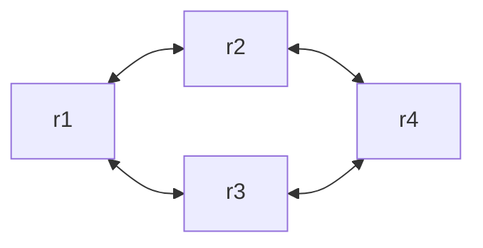

```toc
```
# Active Databases
I database possono reagire facendo qualcosa di più rispetto a quello richiesto dall'utente, mandano in esecuzione delle *regole di produzione* ('business rules' in marketing).

## Event-condition-action (ECA)
L'idea è che esistono dei **trigger** del paradigma **Event-codition-action (ECA)**, specificati da statement DDL `create trigger` che si attivano a un evento (come cancellazione di $n$-uple o loro aggiunta).
Con estensioni procedurali è possibile specificare politiche reattive molto intricate, molto più utile dello standard SQL che permetteva di eseguire solo istruzioni SQL nel DBMS.

## Granularity & execution mode
### Granularity
>[!note] Le azioni del trigger rimangono *atomiche*
>Una transazione atomica, seguita da un trigger, potrebbe sembrare violare la proprietà di atomicità. Questo tuttavia non succede perché la transazione e trigger, <u>insieme</u>, sono *atomiche*.

- livello di *riga*, il trigger viene attivato una volta <u>per ogni</u> tupla su cui l'evento è avvenuto
- livello di *statement*, il trigger viene attivato sullo statement SQL, indipendentemente dal numero di righe, viene <u>eseguito una volta</u>

### Execution mode
Momento in cui va in esecuzione il trigger.
Quando va in esecuzione il mio trigger rispetto la transazione?
- *immediate*, nel momento in cui si ha l'evento;
- *deferred* soltanto se facciamo il commit (maggior parte dei DBMS non li supporta).

## Trigger
```sql
CREATE [ OR REPLACE ] TRIGGER nomeTrigger 
{ BEFORE | AFTER } { INSERT | UPDATE | DELETE } ON nomeTabella
	[ NOT DEFERRABLE | -- execution mode
		[ DEFERRABLE ] [ INITIALLY IMMEDIATE | INITIALLY DEFERRED] ]
	[ FOR [ EACH ] { ROW | STATEMENT } ] -- granularita'
	[ WHEN ( condizione ) ]
	EXECUTE { FUNCTION | PROCEDURE } nomeFunzione ( argomenti )
```

Grazie ai trigger possiamo definire vincoli di reazione, per esempio: le asserzioni non sono presenti come operazioni in PostgreSQL ma possiamo imitarle con i trigger.

### Semantica
La schedule di esecuzione di un trigger, segue l'ordine:
- `BEFORE` statement;
- per ogni tupla sul quale viene eseguito:
	- `BEFORE` row
	- operazione
	- `AFTER` row
- `AFTER` statement

Alcuni sistemi forniscono modo di definire un ordine prioritario sui trigger, in PostgreSQL è il *nome* del trigger che specifica l'ordine (`aaaa` prima di `aa`).

### Estensioni
- eventi temporali attivano i trigger (definiti da utente);
- combinazione di condizioni di verità;
- `INSTEAD OF` per non eseguire l'azione attivante il trigger, ma un'altra;
- modalità d'esecuzione separata, per gestire la transazione separatamente nel caso ci siano problemi;
- priorità definite da utente (nome del trigger per ordinare);
- insieme di regole, la possibilità di attivare/disabilitare un insieme di trigger.

### Proprietà regole attive
- terminazione, studiando l'interazione delle regole di attivazione;
- confluenza;
- comportamento osservabile, se il comportamento rimane lo stesso allo siamo a posto.
  

### Applicazioni
Servizi interni:
- controllo e manutenzione delle integrità dei *constraint*;
- replicazione delle operazioni;
- gestione delle viste:
	- materializzate, ovvero quelle pre-calcolate nel trigger dopo un aggiornamento di tuple;
	- virtuali, ottimizzazione delle query;

Servizi esterni al DBMS codificati da utente:
- descrizione delle dinamiche del DB

#### Esempi
- Eseguire la funzione `check_account_update()` 
  ogni qual volta la colonna `balance` della tabella `accounts` sta per essere aggiornata
  (NOTA: per la `UPDATE` e' possibile specificare la colonna con `ON`)
  ```sql
  CREATE OR REPLACE TRIGGER check_update
	  BEFORE UPDATE OF balance ON accounts
	  FOR EACH ROW
	  EXECUTE FUNCTION chack_account_update();
  ```
- Controllare la correttezza di `CF` (codice fiscale) della tabella `anagrafica`,
  all'inserimento di nuove tuple, eseguendo la funzione `controllo_CF()`
  ```sql
  CREATE OR REPLACE TRIGGER controllo_CF
	  BEFORE INSERT ON anagrafica
	  FOR EACH ROW
	  EXECUTE FUNCTION controllo_CF();
  ```