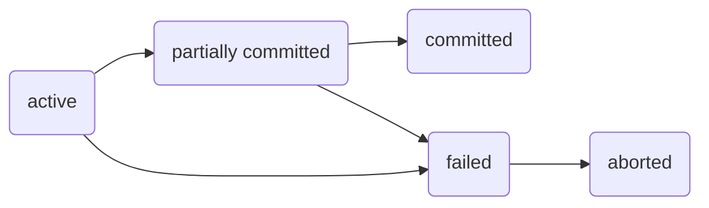

```toc
```

# Transactions
Un'unità di esecuzione del programma che riceve/esegue tanti dati.
Un trasferimento di 50€ sul conto corrente ha dei problemi da gestire:
- il mondo è cattivo, esistono possibili fallimenti, cosa succede se avvengono?
- il mondo prevede che non ci sia una sola persona a fare transazioni, tanti utenti attivano transazioni concorrenti sullo stesso DB, cosa succede?

Una transazione la descriviamo come:
- *attiva* se è in corso;
- *partially committed* se sta per entrare in commit, ovvero l'ultima istruzione è stata eseguita;
- *failed* se scopre che non può più andare avanti per errori;
- *aborted* se una transazione è fallita vuole dire che ha fatto modifica, dobbiamo quindi tornare indietro: *rollback* dei dati originali;
- *committed* se tutti i controlli vanno a buon fine, modifichiamo i dati.


Stabiliamo le terminologie delle transazioni:
- **schedule**
	Una *sequenza d'istruzioni* che specifica l'ordine cronologico nelle quali sono eseguite le istruzioni di un insieme di transazioni; non ho mai un vero e proprio parallelismo, l'idea è che 2 transazioni sono concorrenti quando mischiano le loro esecuzioni. Le *commit* non si scrivono mai, se troviamo l'ultima transazione eseguita dalla schedule, allora siamo sicuri che tutto è andato a buon fine.
	
	> [!example] Esempi di schedule
	> Nello schedule `Seriale`, le istruzioni delle transazioni $T_1$ e $T_2$ sono in blocco unico, quindi soddisfano la proprietà. In `Non seriale`, non sono in un unico blocco ($T_1$ -> $T_2$ -> $T_1$ -> $T_2$), lo schedule è quindi non seriale.
	>  
	>  | Seriale | Non seriale |
	>  | --- | --- |
	>  |  ![[Pasted image 20221202105600.png\|250]] |  ![[Pasted image 20221202092357.png\|250]] |

- **serializzabilità**
	Assumendo che ogni transazione venga controllata in anticipo, un insieme di transazioni preservanti lo stato del DB, le diciamo serializzabili se sono equivalenti a uno schedule seriale.
	- *serializzabilità rispetto ai conflitti*, quand'è che 2 istruzioni potrebbero generare problemi di serializzabilà? Dire che c'è un conflitto non è da solo un problema;
	- rispetto la vista (che non vedremo).

## Conflicting transactions
Stiamo parlando di esecuzione concorrente.
Se le due istruzioni leggono soltanto, cambiare il loro ordine non fa differenza, quindi almeno una delle due deve scrivere sullo stesso dato per avere *conflitto*.
Per un paio di transazioni $I_i$ e $I_j$:

1. $I_i$ read(Q), $I_j$ read(Q) -> <mark style="background: #BBFABBA6;">niente conflitto</mark>
2. $I_i$ read(Q), $I_j$ write(Q) -> <mark style="background: #FF5582A6;">conflitto</mark>
3. $I_i$ write(Q), $I_j$ read(Q) -> <mark style="background: #FF5582A6;">conflitto</mark>
4. $I_i$ write(Q), $I_j$ write(Q) -> <mark style="background: #FF5582A6;">conflitto</mark>

Se ho un conflitto l'ordine di sequenza potrebbe influire il risultato.
> [!nota] Dire che c'è un *conflitto* <u>non equivale</u> a dire che c'è di sicuro un *problema*: potrebbero esserci complicanze, ma queste potrebbero non essere influenti sul risultato
> Per esempio: una `write(Q)` della transazione $T_1$ scrive $0$, `write(Q)` di $T_2$ scrive anche lei $0$, il risultato sarà a prescindere $0$.

### Conflict serialization
Uno schedule $S$ potrebbe non essere seriale, ma se riusciamo a trasformarlo in $S'$ con scambio d'istruzioni non in conflitto, allora questo sarà **equivalente rispetto ai conflitti**. Lo schedule diventa *seriale*.
> [!example] Schedule di transazioni $T_1$ e $T_2$ serializzabile rispetto ai conflitti
> Lo schedule non è seriale (sinistra), ma può diventarlo con uno scambio d'istruzioni (destra).
> 
![[Pasted image 20221202093809.png|450]]

> [!example] Schedule **NON** serializzabile rispetto ai conflitti
> Sappiamo che c'è conflitto se abbiamo `read()` e `write()` sullo stesso dato $Q$ per 2 transazioni separate nello schedule.
> 
> ![[Pasted image 20221202095455.png|250]]

Per verificare la serializzabilità, l'arco di un grafo ipotetico di serie di transazioni $T_1, T_2, ..., T_n$, ordinato in modo tale che $T_1$ venga prima di $T_2$, lo verifica:

| Serializzabile | Non serializzabile |
| -------------- | ------------------ |
|         ![[Pasted image 20221202113707.png]]       |        ![[Pasted image 20221202113510.png]]            |

se non c'è ciclo all'ora l'isolamento è preservato, altrimenti NON è serializzabile rispetto i conflitti perché presente un'inconsistenza temporale. Il grafo `Serializzabile` aciclico visto sopra, può dunque assumere le forme serializzate:

| Forma 1 | Forma 2 |
| ------- | ------- |
|     ![[Pasted image 20221202114204.png]]    |     ![[Pasted image 20221202114244.png]]    |

Esempio di ==schedule serializzabile rispetto ai conflitti==?
Ce ne sono diversi, ma di norma, se il grafo è aciclico, quindi con precedenza, possiamo serializzare.

## Recovering schemas
Potrebbe capitare che una transazione fallisca e se succede, viene fatto rollback.
Uno schedule **NON** è ripristinabile se la transazione $T_j$ legge un dato modificato da $T_i$ (lettura sporca) e questa fa commit: il guaio che capita è che se succedesse abort, non si può tornare indietro.

Parliamo di **cascading rollback** se un problema coinvolgente più transazioni, causa le coinvolte a essere ripristinate, tutte. Evitarlo è necessario siccome l'operazione è molto lenta, quindi da evitare letture sporche. La maggior parte dei sistemi impedisce letture sporche, proprio per eliminare il rischio.

Se riusciamo a implementare **schedule cascadeless**, allora le transazioni che lo compongono possono subire *rollback* insieme.

## $\mathrm{ACID}$ properties
### $\mathrm{A}$tomicity
O va tutto a buon fine (modifiche in commit) o la transazione è come fosse mai avvenuta. Parliamo di **atomicità**. Ci possono essere fallimenti dati da software (colpa nostra o del DBMS come segmentation fault o del SO) o da hardware.
### $\mathrm{C}$onsistency
Ci sono alcuni vincoli d'integrità esplicitamente definiti ma anche impliciti.
Durante l'esecuzione, alcuni vincoli potrebbero essere violati, ma prima di finire devono ricomparire da qualche parte, per essere **consistenti**.
### $\mathrm{I}$solation
Il risultato parziale può essere visto qual'ora una transazione cerca di leggere un dato incosistente, che è in corso di modifica da un'altra transazione.
Per ottenere l'**isolamento** implichiamo la *serializzazione* delle transazioni, anche se la concorrenza ha i suoi vantaggi.
### $\mathrm{D}$urability
La **durabilità** detta che una volta il commit avviene, non importa cosa succeda a problemi avvenuti, la nostra modifica è stata apportata.

# Concurrency control
## Locks
Parliamo di **lock** quando parliamo di concorrenza: sono meccanismi di controllo che bloccano una certa risorsa qual'ora questa debba essere letta o modificata.
- lock **esclusivo** `(X)`
  il dato d'interesse può essere sia letto che scritto,
  per richiedere questo lock usiamo l'istruzione `lock-X`;
- lock **condiviso** `(S)`
  il dato può solamente essere letto,
  per richiederlo usiamo `lock-S`.

Sapendo ciò, possiamo compilare la matrice di compatibilità dei lock: una risorsa avente un lock esclusivo `(X)`, a prescindere non potrà fornire alcun privilegio read/write a nessun altra transazione.

|     | `(S)`                | `(X)`                |
| --- | ---------------- | ---------------- |
| `(S)`   | $\mathtt{true}$  | $\mathtt{false}$ |
| `(X)`   | $\mathtt{false}$ | $\mathtt{false}$                 |
> [!example] Esempio di transazione $T$ che performa locking
> Vediamo che c'è un lock condiviso `(S)` quindi soltanto una lettura sul dato `A` o `B` è possibile. Quando abbiamo finito, sblocchiamo il dato con `unlock (A)` e `unlock (B)`.
>```mermaid
>flowchart LR
>	a("lock-S (A)") --> b("read (A)") --> c("unlock (A)") -- risorsa A --> g
>	d("lock-S (B)") --> e("read (B)") --> f("unlock (B)") -- risorsa B --> g
>	g("display(A + B)")
>```

Il metodo esempio appena visto, non assicura però la serializzabilità: se `A` e `B` vengono aggiornate nel mentre delle letture, allora il risultato `display(A + B)` sarebbe sbagliato. Usiamo **protocolli di lock** per restringere il set di possibili schedule di transazioni.
### Pitfalls of Lock-Based Protocols
I classici problemi relativi all'uso di lock, e quindi al blocco di risorse, sono 2:
- **deadlock**
  ![[Pasted image 20221207150726.png|250]]
  nella tabella sopra, la transazione $T_3$ richiede il lock esclusivo `lock-x (B)` bloccando a se le `read` sulla risorsa `B`, la transazione $T_4$ poco dopo chiede anche lei di leggere `B` ma lo fa con un blocco condiviso `lock-s (B)`, gli tocca quindi aspettare che $T_3$ rilasci il lock ma non accadrà mai siccome essa richiede una `read` con `lock-x (A)` sulla risorsa `A` quando $T_4$ già ha un lock shared `lock-s (A)`. Le due transazioni si mettono in attesa l'una dell'altra ma lo sblocco non accadrà mai. L'unico modo per risolvere è intervenire con uno sblocco manuale e fare rollback, altrimenti applicare [[#Deadlock Handling]].
- **starvation**
  una transazione $T$ sta aspettando `X-lock` su un oggetto mentre una sequenza di altre istruzioni richiedenti `S-lock` vengono eseguite sullo stesso oggetto; sulla stessa transazione viene continuamente fatto rollback a causa deadlock. Il *manager controllore di concorrenza* può essere modellato per evitare starvation.

### Two-Phase Locking Protocol
Questo protocollo di locking assicura (quasi sempre) che gli schedule siano serializzabili in base ai conflitti. Ci sono 2 fasi:
- *growing phase*
  in questa fase una transazione $T$ può ottenere locks come può non rilasciarli;
- *shrinking phase*
  è l'inverso, una transazione $T$ può rilasciare lock come può non ottenerli.

Nonostante sia un passo avanti, la salvezza dai deadlock non viene garantita.
In aggiunta, il cascading rollback nel protocollo a 2 fasi è interamente possibile almeno che non utilizziamo: 
- la sua versione *strict two-phase locking*, dove un lock esclusivo `lock-X` viene mantenuto fino alla `commit`/`abort` di $T$; 
- oppure la sua versione ancora più severa *rigorous two-phase locking*, dove entrambi i tipi di lock non vengono rilasciati fino alla fine.

### Lock conversion
Sarebbe il lock a due fasi con aggiunta la conversione dei lock.
Seguendo rigorosamente le seguenti fasi, la conversione così funziona:
- prima fase
	- può essere acquisito un `lock-S` su risorsa
	- può essere acquisito un `lock-X` su risorsa
	- può essere convertito `lock-S` a `lock-X` -> *upgrade*
- seconda fase
	- può essere rilasciato `lock-S`
	- può essere rilsciato `lock-X`
	- può essere convertito un `lock-X` a `lock-S` -> *downgrade*

Questo protocollo assicura serializzabilità ma si aspetta che l'utente inserisca le varie istruzioni di lock, non c'è automatizzazione.

### Automatic Acquisition of Locks
La transazione $T$ acquisisce non esplicitamente il lock, ogni qual'ora gli serva e aspetta che questo gli venga fornito ogni qual'ora non sia possibile acquisirlo immediatamente. Il lock che viene acquisito è rilasciato solo nel momento in cui viene fatta `commit`/`abort`.

### Deadlock Handling
> [!example] Grafi *wait-for* per visualizzare un deadlock
> Ogni qual volta si presenti un ciclo, in quello che viene chiamato grafo *wait-for*, significa che è presente un deadlock. Nel grafo `wait-for senza ciclo` siamo al sicuro, in quello `wait-for con ciclo` non lo siamo.
> 
> | wait-for senza ciclo | wait-for con ciclo |
> | --- | --- |
> | ![[Pasted image 20221207210502.png\|250]]  | ![[Pasted image 20221207210529.png\|250]]  |

All'individuazione del deadlock, le possibilità non sono molte.
Una transazione toccherà subire rollback (fatta vittima) rispetto un'altra, siccome una delle due coinvolte deve essere sbloccata.
Il rollback di questa transazione può essere o *totale*, quindi tutto viene riavviato, o può essere parziale quando il rollback viene fatto solo sul necessario (possibile starvation se la vittima è sempre la stessa).

I protocolli di *prevenzione di deadlock* assicurano che il sistema non entri mai un uno stato di deadlock:
- **wait-die** non-preemptive
  una transazione più vecchia può aspettare una più giovane che rilasci il lock sulla risorsa, questa transazione può morire più volte prima di acquisire il dato richiesto;
- **wound-wait** preemptive
  una transazione più vecchia si impone su quella nuova e ne forza il rollback, invece che aspettarla, le transazioni giovani aspettano che quelle più vecchie completino il loro lavoro (potrebbe comportare meno rollbacks);
- **timeout-based**
  una transazione aspetta un lock solo per un certo quantitativo di tempo dopo il quale la transazione subisce rollback; utile siccome i deadlock non si presentano ma può avvenire starvation e inoltre il tempo giusto non è facile da determinare;
- **timestamp-based**
  a ciascuna transazione viene assegnato un *timestamp*,
  se una transazione $T_i$ ha timestamp di tipo $TS(T_i)$ 
  allora una transazione $T_j$ che viene dopo, ha assegnato timestamp $TS(T_j)$ $$TS(T_i) < TS(T_j)$$
  per assicurare un ordine di serializzabilità, a ogni dato $Q$ vengono registrati 2 timestamp
	  - `W-timestamp(Q)` è il più grande timestamp di ogni transazione che ha eseguito `write(Q)` con successo
	  - `R-timestamp(Q)` è il più grande timestamp di ogni transazione che ha eseguito `read(Q)` con successo.
	
	in questo modo, se la transazione $T$ con timestamp $TS(T_i)$ cerca di fare 
	- `read(Q)`
	  allora viene verificato $TS(T_i) \leq$ `W-timestamp(Q)` e se non vero-> rollback
	  altrimenti il nuovo valore per $TS(T_i)$ sarà `max(R-timestamp(Q)`
	- `write(Q)`
	  allora vengono verificati
	$TS(T_i) <$ `R-timestamp(Q)` e se non vero-> rollback
	$TS(T_i) <$ `W-timestamp(Q)` e se non vero-> rollback
	altrimenti viene impostato `W-timestamp(Q)` per $TS(T_i)$
# Recovery system
Ci sono più tipi di problemi che si verificano in un DBMS, li classifichiamo in base alla loro gravità e cosa colpiscono:
- **errori di transazione**
	  - **logici**
    la transazione non può completare a causa di errori interni;
	- **di sistema**
	  il DB termina la transazione perché c'è condizione d'errore (come deadlock);
- **system crash** 
  una interruzione di corrente o altri come fallimenti software o hardware
	  - viene assunto un *fail-stop*, i contenuti della memoria non volatile non vengono corrotti, siccome numerosi check d'integrità vengono applicati;
- **fallimento di disco** o **disastro**
  un crash o fallimento di disco distrugge tutti o parte dei dati nella memoria permenente, delle checksum rilevano gli errori.

Alla verifica di qualche disastro i nostri dati sono persi per sempre, perché coinvolgono la memoria su disco fisso (come HDD, o SSD). Per quanto riguarda i crash, la memoria di sistema sopravvive ma non sono da escludere eventuali perdite di dati. La memoria volatile non sopravvive mai crash di sistema, invece.

Alla memoria volatile e non, esiste anche un 3<sup>o</sup> tipo: la *memoria stabile*.
Un tipo di memoria mitica: qualunque cosa succeda a questa, non perderemo mai i nostri dati. Siccome non esiste, il massimo che possiamo fare è imitarla.

## Log-Based Recovery
Il **log** è su memoria del disco fisso.
Sarebbe un file con *sequenze di log*, contiene i record delle attività del DB:
- quando una transazione $T_i$ viene avviata, si registra da sola scrivendo `<T start> log record`;
- prima che esegua una `write(X)`, $T_i$ scrive un log record del tipo $$<T_i, X, V_1, V_2>$$ $V_1$ è il valore di $X$ prima della `write(X)` e 
  $V_2$ il valore che deve essere scritto;
- quando $T_i$ completa il suo ultimo statement, scrive `<T commit>`.

Grazie al log possiamo *tornare indietro* o *rifare* transazioni nel momento in cui ci serve:
- `undo(T)` recupera i valori di tutti i dati aggiornati da $T_i$ e a operazione completa, viene trascritto che la nostra transazione ha eseguito abort
  
   -> andiamo indietro nel log -> ripristino valori -> scrivo `<T abort>`
- `redo(T)` imposta i valori aggiornati da $T_i$, ai nuovi valori
  
  -> andiamo avanti nel log -> riscrivo valori

In sintesi nel momento in cui una transazione $T_i$:
- contiene `<T Start>` ma non contiene `<T commit>` o `<T abort>`,
  allora questa subirà *undone*, impostiamo i vecchi valori;
- contiene `<T start>` e `<T commit>` o `<T abort>`,
  allora questa subirà *redone*, rieseguiamo la transazione.
## Checkpoints
La memoria volatile viene periodicamente salvata nella memoria del disco fisso, permanente. Riusciamo a tornare al momento precedente il fallimento.

Durante il recupero consideriamo le transazioni più recenti che erano in esecuzione durante il **checkpoint**: ripetere tutte le transazioni, nel momento in cui avviene un fallimento, è davvero molto lento e inefficiente; dei *log record* `<checkpoint L>` sono dei punti all'interno del log che indicano il momento in cui il checkpoint viene eseguito.

> [!Example] Come funziona un checkpoint
> ![[Pasted image 20221207124841.png|350]]
> - $T_1$ può essere ignorata siccome ha terminato prima del checkpoint;
> - $T_2$ e $T_3$ devono essere rifatte;
> - $T_4$ viene eliminata e i dati undone.

Il recupero da fallimento, tramite l'uso del checkpoint, ha 2 fasi:
- **redo phase**
  trova l'ultimo record `<checkpoint L>` e tutto quello che non ha fatto commit o abort, viene preso e inserito nella lista undo; 
- **undo phase**
  tutte le transazioni che sono nella lista di undo, subiscono rollback o vengono impostate in stato `<T abort>`, inoltre i log record aggiunti durante il recovery, vengono anche loro aggiunti all'undo pass.
  
![[Pasted image 20221207123822.png|450]]

## Failure with loss of Nonvolatile Storage
Alla morte del nostro disco fisso, non possiamo fare molto: i dati sono andati, non ci sono più e non c'è modo di recuperarli (non sempre).
Eseguire un **dump** serve per fare *backup*: riuscire a recuperare il dump dal disco fisso che non funziona più permette di recuperare tutti i dati.
- recuperare i dati a fallimento del disco, contente memoria permenente;
- operazione utile per eliminare parte del file di log che non serve più.
  
Ci sono processi automatizzati che eseguono dump automaticamente, non ha senso fare backup sullo stesso disco che muore, siccome è avvenuto un **disastro** e non possiamo fare nulla, un disco ausiliario spesso usato solo per i backup viene invece utilizzato.