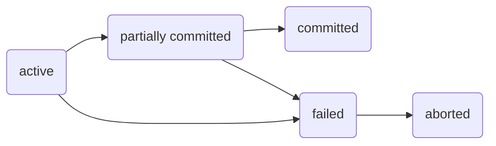

# Transazioni
Un'unità di esecuzione del programma che riceve/esegue tanti dati.
Un trasferimento di 50€ sul conto corrente ha dei problemi da gestire:
- il mondo è cattivo, esistono possibili fallimenti, cosa succede se avvengono?
- il mondo prevede che non ci sia una sola persona a fare transazioni, tanti utenti attivano transazioni concorrenti sullo stesso DB, cosa succede?

Una transazione la descriviamo come:
- *attiva* se è in corso;
- *partially committed* se sta per entrare in commit, ovvero l'ultima istruzione è stata eseguita;
- *failed* se scopre che non può più andare avanti per errori;
- *aborted* se una transazione è fallita vuole dire che ha fatto modifica, dobbiamo quindi tornare indietro: *rollback* dei dati originali;
- *committed* se tutti i controlli vanno a buon fine, modifichiamo i dati.

Stabiliamo le terminologie delle transazioni:
- **schedule**
	Una *sequenza d'istruzioni* che specifica l'ordine cronologico nelle quali sono eseguite le istruzioni di un insieme di transazioni; non ho mai un vero e proprio parallelismo, l'idea è che 2 transazioni sono concorrenti quando mischiano le loro esecuzioni. Le *commit* non si scrivono mai, se troviamo l'ultima transazione eseguita dalla schedule, allora siamo sicuri che tutto è andato a buon fine.
	
	> [!example] Esempi di schedule
	> Nello schedule `Seriale`, le istruzioni delle transazioni $T_1$ e $T_2$ sono in blocco unico, quindi soddisfano la proprietà. In `Non seriale`, non sono in un unico blocco ($T_1$ -> $T_2$ -> $T_1$ -> $T_2$), lo schedule è quindi non seriale.
	>  
	>  | Seriale | Non seriale |
	>  | --- | --- |
	>  |  ![[Pasted image 20221202105600.png\|250]] |  ![[Pasted image 20221202092357.png\|250]] |

- **serializzabilità**
	Assumendo che ogni transazione venga controllata in anticipo, un insieme di transazioni preservanti lo stato del DB, le diciamo serializzabili se sono equivalenti a uno schedule seriale.
	- *serializzabilità rispetto ai conflitti*, quand'è che 2 istruzioni potrebbero generare problemi di serializzabilà? Dire che c'è un conflitto non è da solo un problema;
	- rispetto la vista (che non vedremo).

## Transazioni in conflitto
Stiamo parlando di esecuzione concorrente.
Se le due istruzioni leggono soltanto, cambiare il loro ordine non fa differenza, quindi almeno una delle due deve scrivere sullo stesso dato per avere *conflitto*.
Per un paio di transazioni $I_i$ e $I_j$:

1. $I_i$ read(Q), $I_j$ read(Q) -> <mark style="background: #BBFABBA6;">niente conflitto</mark>
2. $I_i$ read(Q), $I_j$ write(Q) -> <mark style="background: #FF5582A6;">conflitto</mark>
3. $I_i$ write(Q), $I_j$ read(Q) -> <mark style="background: #FF5582A6;">conflitto</mark>
4. $I_i$ write(Q), $I_j$ write(Q) -> <mark style="background: #FF5582A6;">conflitto</mark>

Se ho un conflitto l'ordine di sequenza potrebbe influire il risultato.
> [!nota] Dire che c'è un *conflitto* <u>non equivale</u> a dire che c'è di sicuro un *problema*: potrebbero esserci complicanze, ma queste potrebbero non essere influenti sul risultato
> Per esempio: una `write(Q)` della transazione $T_1$ scrive $0$, `write(Q)` di $T_2$ scrive anche lei $0$, il risultato sarà a prescindere $0$.

### Serializzabilità sui conflitti
Uno schedule $S$ potrebbe non essere seriale, ma se riusciamo a trasformarlo in $S'$ con scambio d'istruzioni non in conflitto, allora questo sarà **equivalente rispetto ai conflitti**. Lo schedule diventa *seriale*.
> [!example] Schedule di transazioni $T_1$ e $T_2$ serializzabile rispetto ai conflitti
> Lo schedule non è seriale (sinistra), ma può diventarlo con uno scambio d'istruzioni (destra).
> 
![[Pasted image 20221202093809.png|450]]

> [!example] Schedule **NON** serializzabile rispetto ai conflitti
> Sappiamo che c'è conflitto se abbiamo `read()` e `write()` sullo stesso dato $Q$ per 2 transazioni separate nello schedule.
> 
> ![[Pasted image 20221202095455.png|250]]

Per verificare la serializzabilità, l'arco di un grafo ipotetico di serie di transazioni $T_1, T_2, ..., T_n$, ordinato in modo tale che $T_1$ venga prima di $T_2$, lo verifica:

| Serializzabile | Non serializzabile |
| -------------- | ------------------ |
|         ![[Pasted image 20221202113707.png]]       |        ![[Pasted image 20221202113510.png]]            |

se non c'è ciclo all'ora l'isolamento è preservato, altrimenti NON è serializzabile rispetto i conflitti perché presente un'inconsistenza temporale. Il grafo `Serializzabile` aciclico visto sopra, può dunque assumere le forme serializzate:

| Forma 1 | Forma 2 |
| ------- | ------- |
|     ![[Pasted image 20221202114204.png]]    |     ![[Pasted image 20221202114244.png]]    |

Esempio di ==schedule serializzabile rispetto ai conflitti==?
Ce ne sono diversi, ma di norma, se il grafo è aciclico, quindi con precedenza, possiamo serializzare.

## Ripristinare lo stato degli schemi
Potrebbe capitare che una transazione fallisca e se succede, viene fatto rollback.
Uno schedule **NON** è ripristinabile se la transazione $T_j$ legge un dato modificato da $T_i$ (lettura sporca) e questa fa commit: il guaio che capita è che se succedesse abort, non si può tornare indietro.

Parliamo di **cascading rollback** se un problema coinvolgente più transazioni, causa le coinvolte a essere ripristinate, tutte. Evitarlo è necessario siccome l'operazione è molto lenta, quindi da evitare letture sporche. La maggior parte dei sistemi impedisce letture sporche, proprio per eliminare il rischio.

Se riusciamo a implementare **schedule cascadeless**, allora le transazioni che lo compongono possono subire *rollback* insieme.

## Controllo della concorrenza
Meccanismi che il DBMS applica per assicurare le proprietà che abbiamo visto.

## Proprietà $\mathrm{ACID}$
### $\mathrm{A}$tomicity
O va tutto a buon fine (modifiche in commit) o la transazione è come fosse mai avvenuta. Parliamo di **atomicità**. Ci possono essere fallimenti dati da software (colpa nostra o del DBMS come segmentation fault o del SO) o da hardware.
### $\mathrm{C}$onsistency
Ci sono alcuni vincoli d'integrità esplicitamente definiti ma anche impliciti.
Durante l'esecuzione, alcuni vincoli potrebbero essere violati, ma prima di finire devono ricomparire da qualche parte, per essere **consistenti**.
### $\mathrm{I}$solation
Il risultato parziale può essere visto qual'ora una transazione cerca di leggere un dato incosistente, che è in corso di modifica da un'altra transazione.
Per ottenere l'**isolamento** implichiamo la *serializzazione* delle transazioni, anche se la concorrenza ha i suoi vantaggi.
### $\mathrm{D}$urability
La **durabilità** detta che una volta il commit avviene, non importa cosa succeda a problemi avvenuti, la nostra modifica è stata apportata.